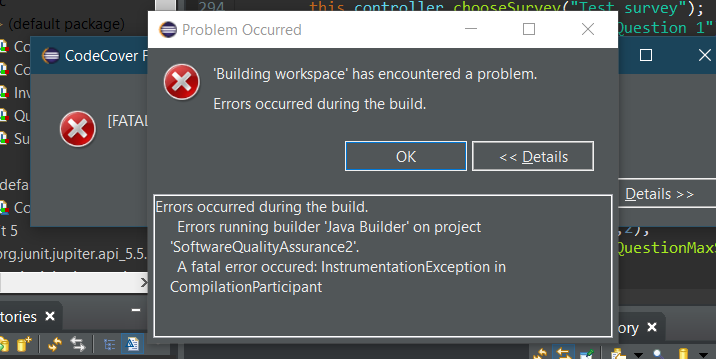
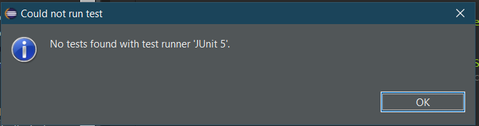

# Project Documentation

## Scrum sprint backlog and task Estimation

|User Story|Tasks|Estimation|
|----------|:----------:|-----:|
|I can create a new survey||Medium|Create Controller class| small|
| | Create Caller Class| small|
| | Create survey object | small|
| | Give Survey name attribute |small|
| |Give Controller class a list of survey objects |small|
| | Give controller class a createSurvey method |small|
| | Give createSurvey method funtionality to create new survey object, and prompt user for name|small|
| | Give caller class option to call controller class createSurvey method  |small|
|I can add a question to a survey| |Medium ||
| |Create question object  |small|
| |Give question questionText attribute  |small|
| |Give question object a list of answers as ints  |small|
| |Give Survey object list of question objects  |small|
| |Create addQuestion in survey class which adds parameter question to question list|small|
| |Create addQuestion in controller class|small|
| |Write functionality for AddQuestion|small|
| |Prompt user to input question text for new question|small|
| |Add method to caller class that calls addQuestion in contoller class|small|
|I can get a list of all surveys ||Medium ||
| |Give Contoller class method listSurveys()|small|
| |Make getAllSurveys() method return a list of all surveys|small|
| |Give Caller class listAllSurveys() method that calls getAllSurveys() method from Controller|small|
| |Make listAllSurveys() method iterate through list returned from getAllSurveys(), and display all information|small|
|I can get a specific survey by name| |Medium ||
| |Give Controller getSurveyByName() method|small|
| |Make getSurveyByName take in a String name|small|
| |Make getSurveyByName() iterate through all surveys until the name of one of those surveys match the string name|small|
| |Make getSurveyByName() return Survey object|small|
|I can create a new SurveyResponse| |Medium| ||
| |Iterate through all surveys, or specific survey by name, using appropriate methods: getAllSurveys() or getSurveyByName()|small|
| |Iterate through all questions in each Survey selected|small|
| |Display question text and prompt for input of an interger between 1-5 (check that answer is 1-5, if not loop and prompt again)|small|
| |For each prompt, take in answer and add to Question objects answerList|small|
|I can get all the survey responses associated with a specfic survey| |Medium ||
| |Add getAllSurveyResponses() method to Controller class|small|
| |Make getAllSurveyResponses() take in a String name|small|
| |Make getAllSurveyResponses() pass String name into getSurveyByName() method|small|
||Make getAllSurveyResponses() return list of question objects from survey object returned by getSurveyByName() method|small|
||give Caller class getAllSurveyResponses() method which takes in a String|small|
||Make getAllSurveyResponses() method pass String name into Controllers getAllSurveyResponses() method|small|
||Iterate through question object list returned by Controllers getAllSurveyResponses() method, print each question objects answer data|small|
|I can get the average response to a survey||Medium ||
||Add getAverageResponse() method to question object|small|
||in Questions getAverageResponse() iterate through all answers in the questions answerList, adding all the values to a variable|small|
||When iteration is finished, divide answerList by its size to get it's average|small|
||Return this average|small|
||Add getAverageResponse() method to Survey class|small|
||Make getAverageResponse() iterate through the surveys question list, and call getAverageResponse() on each of the question objects|small|
||Add the value from each questions getAverageResponses() to a variable|small|
||Divide this varible by the size of the question list to get the average value|small|
||return the average|small|
||Create getAverageSurveyResponses() method in Controller class that takes in a String name|small|
||Make getAverageResponse pass name into getSurveyByName()|small|
||Call getAverageResponses() on this survey class to get the average|small|
||Return this average|small|
||Create method in caller class to call Controllers getAverageResponse() method and print the answer|small|
|I can get the standard deviation of a survey's responses||Medium||
||Create getStandardDeviation() method in Survey class|small|
||In this class, call the survey method getAverageResponses() set a variable called 'average' to the result|small|
||Iterate through each of the Surveys question objects. on each object call its getAverageResponses() method.|small|
||Subtract the value from this method from average to get the difference, then square the difference. Save these values to a list|small|
||find the average of these squared differences by iterating through the list, adding each value to a variable, and then dividing by the size of the list.|small|
||return this value|small|
||Add a getSurveyStandardDevidation() method to the Controller class, which takes a String name|small|
||Pass String name to getSurveyByName() method|small|
||Call getStandardDeviation() on Survey object returned by getSurveyByName()|small|
||Return this value|small|
||Create getSurveyStandardDeviation() method in caller class which prompts user for the name of a survey, and passes this value to the Controllers getSurveyStandardDeviation() method|small|
||Print out this value|small|
|I can get the maximum score for a survey||small||
||Create getMaximumScore() method in Question object|small|
||Make getMaximumScore() set a variable 'maximumScore' equal 0, and iterate through the questions answer list, setting maximumScore to the value of the answer if the value of the answer is greater than maximumScore|small|
||Return this value|small|
||Create getMaximumScore() method in Survey class|small|
||Make getMaximumScore() set a variable 'maximumScore' equal 0, and iterate through the surveys question list, setting maximumScore to the value of the returned by calling getMaximumScore() on the question object if the value returned is greater than maximumScore|small|
||Return this value|small|
||Create getMaximumSurveyScore() method in Controller class which takes in a string name|small|
||Create getMaximumSurvey() method in Caller class which prompts the user for a survey name and passes this name in the Controller Classes getMaximumServey()|small|
||Print the value returned from getMaximumSurvey()|small|
|I can get the minimum score for a survey||Small||
||Create getMinimumScore() method in Question object|small|
||Make getMinimumScore() set a variable 'minimumScore' equal 5, and iterate through the questions answer list, setting minimumScore to the value of the answer if the value of the answer is less than minimumScore|small|
||Return this value|small|
||Create getMinimumScore() method in Survey class|small|
||Make getMinimumScore() set a variable 'minimumScore' equal 5, and iterate through the surveys question list, setting minimumScore to the value of the returned by calling getMinimumScore() on the question object if the value returned is less than minimumScore|small|
||Return this value|small|
||Create getMinimumSurveyScore() method in Controller class which takes in a string name|small|
||Create getMinimumSurveyScore() method in Caller class which prompts the user for a survey name and passes this name in the Controller Classes getMinimumSurveyScore()|small|
||Print the value returned from getMinimumSurvey()|small|
|I can get the average response to a specific question on a survey||Medium ||
||Create getQuestion() method in controller class|small|
||Make getQuestion take in a string value to represent the desired question|small|
||Search question list of current Survey until desired question is found|small|
||return this question|small|
||Create getQuestionAverage() method in controller class which takes string representation of desired question and passes it to getQuestion()|small|
||Call getAverageResponse on returned question|small|
||Return this value|small|
||Create GetQuestionAverage Method which promts user for String to search for question with, and passes this value to getQuestionAverage() in controller|small|
||Print this value to the screen|small|
|I can get the standard deviation of a specific question on a survey||Medium||
||Create getQuestionStandardDeviation() method in controller class which takes string representation of desired question and passes it to getQuestion()|small|
||Call getStandardDeviation() on returned question|small|
||Return this value|small|
||Create GetQuestionStandardDeviation() Method which promts user for String to search for question with, and passes this value to getQuestionStandardDeviation() in controller|small|
||Print this value to the screen|small|
|I can get the maximum score for a specific question on a survey||Medium||
||Create getQuestionMaximum() method in controller class which takes string representation of desired question and passes it to getQuestion()|small|
||Call getMaximum on returned question|small|
||Return this value|small|
||Create GetQuestionMaximum Method which promts user for String to search for question with, and passes this value to getQuestionMaximum() in controller|small|
||Print this value to the screen|small|
|I can get the minimum score for a specific question on a survey||Medium||
||Create getQuestionMinimum() method in controller class which takes string representation of desired question and passes it to getQuestion()|small|
||Call getMinimum on returned question|small|
||Return this value|small|
||Create GetQuestionMinimum Method which promts user for String to search for question with, and passes this value to getQuestionMinimum() in controller|small|
||Print this value to the screen|small|

Small= Will take less than an hour.

Medium= Will take More than an hour, but less than three hours.

Large = Will take more than three hours.

I based these estimates off of experience recording how long it takes me to complete tasks this size in previous projects.
Taking into consideration how much of the task can be generated such as simple getter and setter methods, or wheter the solution can be built upon solutions to other tasks, ect.

## Velocity

Velocity is the measurment of the amount of work a team can complete in a single sprint. It is calucalted by adding the values of all the estimations of each completed task.

Velocity is a key feedback metric for comparing how much work is being completed in each alloted timeframe, and should be used to understand what practises and changes are hurting productivity and which are helping it. A team should idealy see their velocity increase by 10% each sprint.

Without velocity release planning is impossible, as the time that it will take to complete a full project cannot be forcast without an understanding of the speed in which a team can complete user stories.

## Test Coverage

Originaly i tried to use an Eclipse called CodeCover to complete this section of the assesment. I chose this tool because, the reaserch that i performed concerning code coverage tools lead me to believe that this tool was best suited for use with the eclipse enviroment. However, when i ran this tool on my project, it seems to have broken my project set-up, and after running sucessfuly only once, which i unfortunatly failed to capture, it would only return the following error: 

It also caused some sort of break in the project layout, as after this error occured, running my testing class would give this error: 
and a ClassNotFound exception, for a class which clearly exists.

Thankfuly i had already completed all of my testing for the project completed. I was also able to get the JUnit testing to temporaily run again by revering to a previous commit.

I then followed a tutorial for another coverage tool called EclEmma. I though this tool would work well as i could see someone using the tool in the tutorial video. However, it seems that the error caused by codeCover is not completly resolved, regardless of the fact that i uninstalled the plugin, as when i tried to run the new tool the JUnit error reapeared.

I have not been able to resolve the issue, and therefore could not complete this section of the assignment. My apologies.

## Team Version Control

For my version control on this assignment, i broke the project down accross 3 branches. I of course had the master branch, but i also had two more branches for handling the functionality of Survey objects and Question objects respectivly.

At one point, after i had completed the Question branch and merged it back into the master branch, i had to merge and re-branch the Survey branch, as some functionality of Survey relied on the functionality of the question object.

## Code-Review Checklist

Here is my checklist that i belive one should work through before approving any pull request.

* Does the code perform the functionality that it is claiming to? In other words, does the code work?

* Has the code been properly tested?

* Are there conflicts between the two branches that must be resolved?

* Is the code easily understandable? is it well commented? If not, it will cause problems for future development.

* Is there any redundant or duplicate code? Can any unessasary code be eliminated before the pull request is approved?

* Is the code as modular as possible? is it following correct OOP standards? if not, the code should be re-examinded before being merged.

* Can any global variables be replaced?

* Can any code be replaced with library functions? This is improtant for a number of reasons, such as reducung the amount of code that must be maintained in the future, and reducing unessasery work that can be completed with a library rather than reinvented.

* Is there any debugging code that can be removed?

* Does the code follow current project standards and defined architecture?

* Are there any warnings on the code? Red errors are usualy fixed, but yellow warnings tend to be ignored.

* Are good names being used for variables and functions? Can the purpose of these atributes be intuitivly understood?

For example, i point to my approved pull request #2 from ConnorByrne/SurveyFunctionality.
Obviously there were certain aspects of the project that i was aware of, and could double check before i even created the pull request, Such as: the programs standard, modularity, warnings, redundant code, how understandable the code is, and how well it had been tested, as i had written the code myself. But before i approvd the pull request i was able to review the code to be merged into the master brance for conflicts that would be caused by this merge, and refactor the code appropriately.
